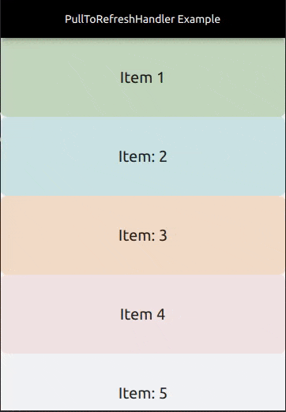

# PullToRefreshHandler
This QML component implements pull-to-refresh feature.

## Simple


## Swipe up hint


## Usage: 
Add the `PullToRefreshHandler.qml` file to your project and put PullToRefreshHandler component to your flickable element (e.g ListView):

```
    ListView
    {
        delegate: ItemDelegate
        {
            text: model.text
            width: parent.width
        }

        PullToRefreshHandler
        {
            onPulldownrelease:
            {
                // Add your handling code here:
            }

            onPulluprelease:
            {
                // Add your handling code here:
            }
        }
    }
```

### Signals:
+ signal `pulldown()`
+ signal `pullup()`
+ signal `pulldownrelease()`
+ signal `pulluprelease()`

### Properties:
+ `flickable`: var => Target flickable element, default is set to parent
+ `threshold`: int => The threshold of distance changes in the percentage of the parent height
+ `is_pulldown` (Readonly): bool
+ `is_pullup` (Readonly): bool 
+ `swipe_up_hint_delegate`: Component => Any QML visual item to show when the flickable is scrolled to the end.
+ `swipe_down_hint_delegate`: Component => Any QML visual item to show when the flickable is scrolled to the beginning.
+ 
