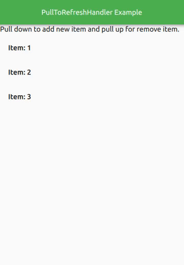

# PullToRefreshHandler
QML module for easy to use pull-to-refresh feature in Qt Quick.


## Breaking changes:
Note that in version `2.0` some changes happened that you need to update your code, if you want to migrate to `2.0`:
```
- All elements moved to the com.melije.pulltorefresh module.
- Project code convention change to the camleCase for better compatibility with QML.
- `flickable` property in `PullToRefreshHandler` renamed to `target`.
```

## Screenshots:

|  |     |  |
| :-------------------------: | :----------------------------------: | :--------------------------: |
|          `Simple`           |         `Refresh indicator`          |         `Swipe up hint`      |

## Requirements:
Qt >= 5.12

## Install:
1. Add the `PullToRefreshHandler.pri` to your project file (`.pro`), like the following:
```
include(Path/to/PullToRefreshHandler.pri)
```
2. Add the `engine.addImportPath("qrc:/");` to the `main.cpp` file, before `engine.load()` call.

## Usage:
1. Add `import com.melije.pulltorefresh 2.0` to your `qml` file.

2. Put the `PullToRefreshHandler` component on the flickable element (e.g ListView):

```
    ListView
    {
        delegate: ItemDelegate
        {
            text: model.text
            width: parent.width
        }

        PullToRefreshHandler
        {
            onPullDownRelease:
            {
                // Add your handling code here:
            }

            onPullUpRelease:
            {
                // Add your handling code here:
            }
        }
    }
```

### Signals:
+ signal `pullDown()`
+ signal `pullUp()`
+ signal `pullDownRelease()`
+ signal `pullUpRelease()`

### Properties:
+ `target`: Flickable => Target flickable element, default is set to parent
+ `threshold`: int => The threshold of distance changes in the percentage of the parent height
+ `isPullDown` (Readonly): bool
+ `isPullUp` (Readonly): bool
+ `swipeUpHintDelegate`: Component => Any QML visual item to show when the flickable is scrolled to the end.
+ `swipeDownHintDelegate`: Component => Any QML visual item to show when the flickable is scrolled to the beginning.
+ `refreshIndicatorDelegate`: Component => Any QML Visual item to show when the flickable is scrolled to down or up, if you do not set this delegate, the default refresh indicator (Matrerial Refresh Indicator like) will show.
+ `indicatorDragDirection`: IndicatorDragDirection enum => `indicatorDragDirection` will specify when the `refreshIndicator` must be shown, the default value is `TOPTOBOTTOM`.

### IndicatorDragDirection enums:
|    Constant    |
| :------------: |
|  TOPTOBOTTOM   |
|  BOTTOMTOTOP   |

## Custom Refresh Indicator:
Any QML visual element can use as the refresh indicator, so you can easily create your custom refresh indicator.
When you set `refreshIndicatorDelegate` to your custom refresh indicator, `PullToRefreshHandler` will exposes the `dragProgress` and `target` variables to your component so you can represent the progress using the values of these.

a simple example:
```
PullToRefreshHandler
{
    id: pulldown_handler
    threshold: 20
    refreshIndicatorDelegate: Rectangle {
        x: (pulldown_handler.width - width) / 2
        color: Qt.rgba(1, 0, 0, (dragProgress / 100))
        width: 24
        height: 24
        radius: width / 2
    }
}
```
For more complex implementation, please read the `src/com/melije/pulltorefresh/RefreshIndicator.qml`.

## Notes:
If you want to disable the refresh indicator you must change `refreshIndicator.active` to the false.

## Contribution:
Please help me to improve the quality of the project, contributions are welcome! :)